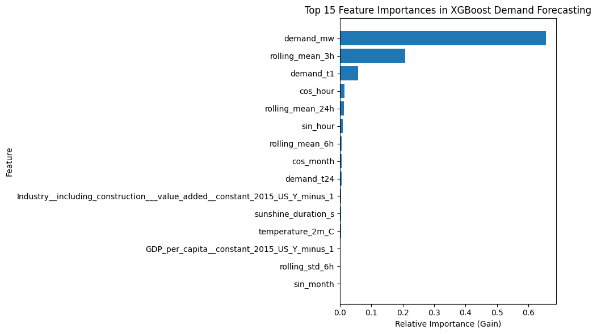

## Test MAPE: 1.86%
 I used XGBoost tree-based ML pipeline for the given task.

 ## 1.Data Preparation & Anomaly Handling
 The raw national grid data contained severe spikes, missing timestamps, and potential data leakage risks. I employed following techniques to tackle these problems :-
  1. All data was forced into a strict hourly grid (.resample('H')). 
  2. All supply-side metrics (e.g., generation, fuel mix, load shedding) were dropped to prevent the model from "cheating" by learning the grid's post-facto dispatch physics.
  3. Anomaly Detection: Rather than using a standard Z-score (which gets skewed by massive outliers), a 24-hour Rolling Median and Interquartile Range (IQR) was used. A conservative multiplier of 3.0 was applied to flag extreme spikes without erasing natural legitimate demand peaks.
  4. Missing Data Handling: Anomalies and missing gaps were replaced with NaN rather than interpolated. Because XGBoost utilizes a sparsity-aware split-finding algorithm, it naturally learns the best direction to route missing values. This prevents the bias that linear interpolation introduces during volatile grid events.

 ## 2. Feature Engineering 
 To convert the data into a trainable features i employed following techniques :
  1. Time Encoding: Features like hour_of_day , month etc were transformed using Sine and Cosine functions to maps time onto a continuous circle, allowing the model to mathematically understand that Hour 23 smoothly transitions into Hour 0.
  2. Historical feature : To capture grid momentum, lagged features were created using past data:$t-1$ and $t-2$ for immediate short-term momentum.$t-24$ to capture daily behavioral seasonality.$t-168$ to capture weekly behavioral seasonality.
  3. Rolling Volatility: 3-hour, 6-hour, and 24-hour rolling averages and standard deviations were calculated to give the model context on recent grid volatility.
  4. Macroeconomic Integration: To help the model understand long-term baseline growth, key annual macro indicators (like Industrial Value Added) were joined to the hourly data using a strict $Y-1$ lag, ensuring no future economic data leaked into the current hour's prediction.
 ## 3. Training & Feature Importances 
 Model was trained using an expanding-window TimeSeries cross-validation to tune hyperparameters without data leak . 
 ## Final feature importance :- 
 
 